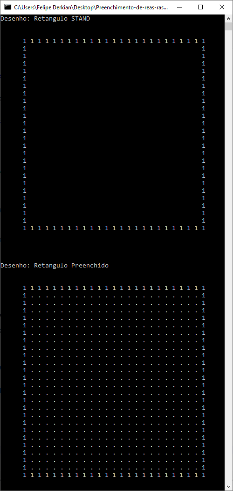
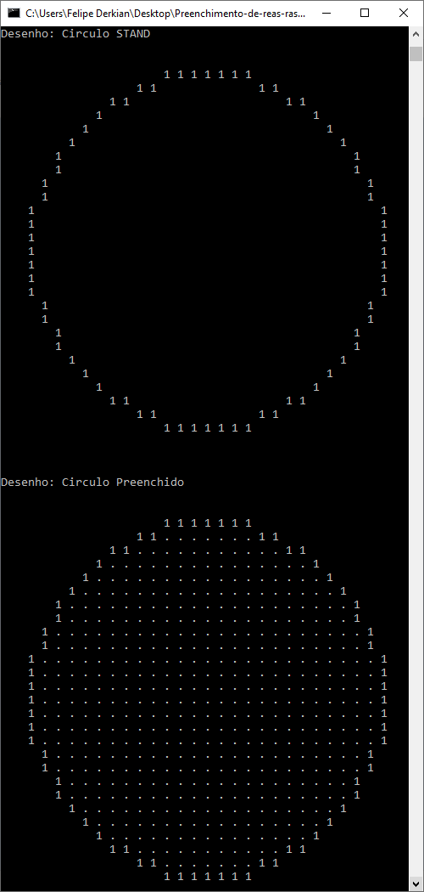
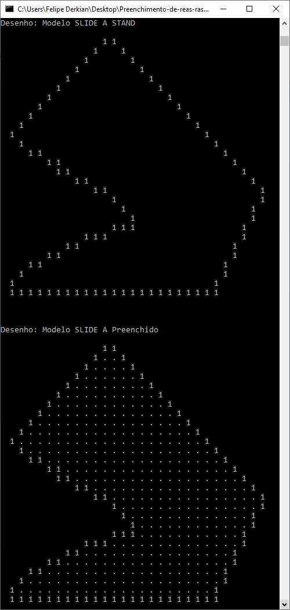
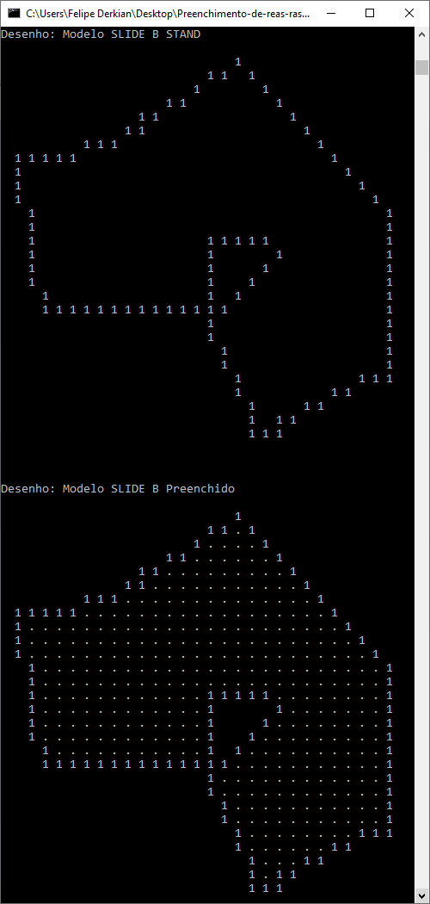
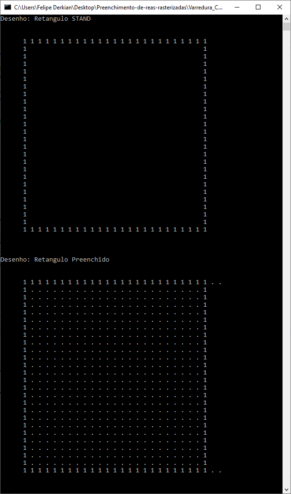
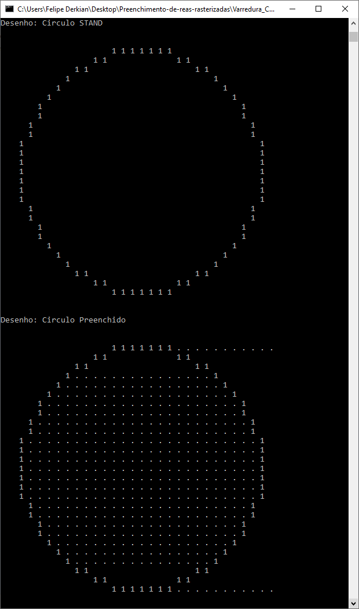
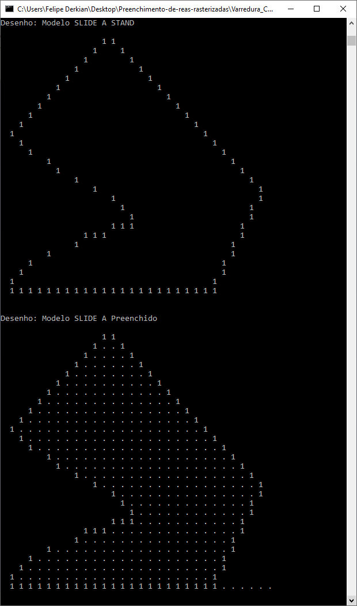
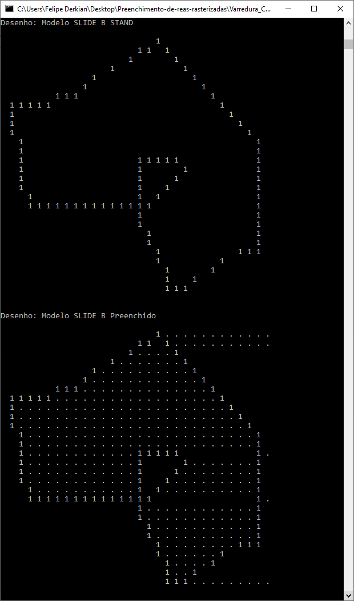

# PREENCHIMENTO DE ÁREAS 2D COM FLOOD FILL E VARREDURA

## [_*LINK PARA O TRABALHO ESCRITO*_](https://github.com/felipekian/PREENCHIMENTO-DE-AREAS-2D-COM-FLOOD-FILL-E-VARREDURA/tree/master/Trabalho_Escrito)

## ALGORITMO DE FLOOD FILL

O algoritmo de Flood Fill é um algoritmo recursivo que percorre toda figura 2D até encontrar todas as bordas da figura. Caso a figura tenha alguma figura dentro dela, dependendo da semente essa outra figura interna não será pintada.


### PONTOS POSITIVOS DO ALGORITMO FLOOD FILL

Para figuras simples e complexas ele faz um trabalho muito bom. Tudo depende da coordenada da semente informada e da figura ele pinta muito bem. Veremos com mais detalhes nos exemplos.


### PONTOS NEGATIVOS DO ALGORITMO FLOOD FILL

Para figuras onde possuem figuras dentro de figuras, ele acaba pintando apenas a área entre as bordas de uma figura e outra. Veremos com mais detalhes nos exemplos.

### DESEMPENHO DO ALGORITMO FLOOD FILL

O desempenho do algoritmo é muito bom e de fácil implementação. Mas caso a imagem seja muito grande pode não ser muito bom pois como é recursivo pode gerar uma pilha de recursão muito grande e isso deixa o algoritmo com desempenho prejudicado.


### PSEUDO CÓDIGO DO ALGORITMO FLOOD FILL
```
Função FloodFill recebe x, y, corBase, novaCor:
  se pixel(x,y) for igual a corBase faça
    setPixel(x,y) recebe novaCor
    FloodFill recebe x+1, y, corBase e novaCor
    FloodFill recebe x, y+1, corBase e novaCor
    FloodFill recebe x-1, y, corBase e novaCor
    FloodFill recebe x, y-1, corBase e novaCor
  senão
    retorne
```

###  ALGORITMO FLOOD FILL EM LINGUAGEM C
```
void FloodFill(int figura[TAM_MAT_FIG][TAM_MAT_FIG] , int x, int y){
  if(figura[x][y] == BORDA){
    return;
  }else if(figura[x][y] == COLOR_TARGET){
    figura[x][y] = COLOR_NEW;
    FloodFill( figura , x+1 , y );
    FloodFill( figura , x-1 , y );
    FloodFill( figura , x , y+1 );
    FloodFill( figura , x , y-1 );
  }
}
```

### CÓDIGO FONTE

[_**lINK PARA O CÓDIGO FONTE**_](https://github.com/felipekian/PREENCHIMENTO-DE-AREAS-2D-COM-FLOOD-FILL-E-VARREDURA/tree/master/Flood_Fill)


### EXECUÇÃO DO ALGORITMO FLOOD FILL









---

## ALGORITMO VARREDURA COM ANÁLISE GEOMÉTRICA

O algoritmo varredura com análise geométrica funciona da seguinte forma, varre a imagem a procura de uma borda para ativar a pintura, quando encontra ele começa a pintar até encontrar outra borda que desativa a pintura da imagem. Ou seja, as bordas são indicadores de ativa e desativa. Mas esse algoritmo tem vários problemas que veremos mais tarde.

### PONTOS POSITIVOS DO ALGORITMO VARREDURA COM ANÁLISE GEOMÉTRICA

Para figuras como retângulos, círculos, imagens dentro de imagens podem funcionar dependendo dos casos. É um algoritmo eficiente computacionalmente pois apenas faz incremento e comparações, diferente do Flood Fill que apesar de ser muito bom com certas imagens é recursivo e casos a imagem seja muito grande pode a pilha de recursão ficar muito grande.

### PONTOS NEGATIVOS DO ALGORITMO VARREDURA COM ANÁLISE GEOMÉTRICA

Como ele é um algoritmo que basicamente funciona ativando e desativando a pintura de acordo com o encontro de bordas da figura ele pode ter vários problemas. Se em determinada linha tivermos um número ímpar de pontos que ativem e desativem a pintura ocorrerá que o algoritmo pintará onde não deveria. Veremos daqui a pouco testes e vendo isso ocorrer.


### DESEMPENHO DO ALGORITMO VARREDURA COM ANÁLISE GEOMÉTRICA

É um algoritmo eficiente computacionalmente, pois faz apenas faz comparações e incrementos.


### PSEUDO CÓDIGO DO ALGORITMO VARREDURA COM ANÁLISE GEOMÉTRICA
```
Função Varredura recebe a figura:
  para i de 1 até tamanho da imagem faça:
    para j de 1 até tamanho da imagem faça:
      se figura na posição (i, j) for igual à borda faça:
        enquanto figura na posição (i, j=j+1) for diferente da borda e j
      menor que tamanho da imagem faça:
        figura na posição (i, j) recebe nova cor
```

### ALGORITMO VARREDURA COM ANÁLISE GEOMÉTRICA COM A LINGUAGEM C
```
void varreduraComAnaliseGeometrica(int figura[TAM_MAT_FIG][TAM_MAT_FIG] ){
  int i , j;
  for(i=0 ; i<TAM_MAT_FIG ; i++){
    for(j=0 ; j<TAM_MAT_FIG ; j++){
      if(figura[i][j] == BORDA){
        while(figura[i][++j] != BORDA && j<TAM_MAT_FIG){
          figura[i][j] = COLOR_NEW;
        }
      }
    }
  }
}
```

### CÓDIGO FONTE

[_**lINK PARA O CÓDIGO FONTE**_](https://github.com/felipekian/PREENCHIMENTO-DE-AREAS-2D-COM-FLOOD-FILL-E-VARREDURA/tree/master/Varredura_Com_Analise_Geometrica)


### EXECUÇÃO DO ALGORITMO FLOOD FILL










## OBRIGADO PELA ATENÇÃO!
